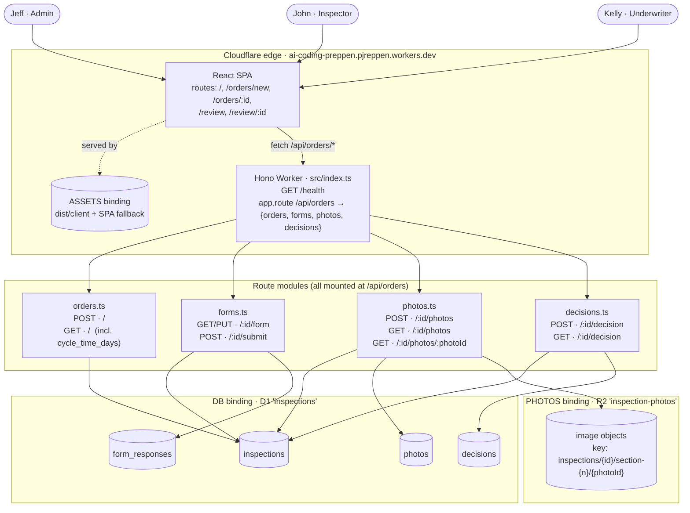

# Architecture

> **Last regenerated:** 2026-05-26
> **Generated from:** `wrangler.toml`, `src/index.ts`, `src/routes/*`, `src/client/main.tsx`, `migrations/*.sql`.
> Regenerate at the end of every week — if it no longer matches the code, something drifted and it's worth a 10-minute review.

## How it works

The SPA and the API share one domain. Static assets (the built React SPA) are served by Workers' `ASSETS` binding with single-page-application fallback, so any non-API path returns `index.html` and the client-side router takes over. Anything under `/api/orders/*` falls through to the Hono Worker, which fans out to four route modules — `orders`, `forms`, `photos`, `decisions` — all mounted under the same prefix. Persistence is split: structured records in D1 (`DB` binding, four tables), image bytes in R2 (`PHOTOS` binding), with D1 holding only an `r2_key` pointer per photo. There is no auth in v1 (PRD §6), so all three users — Jeff, John, Kelly — hit the same SPA and the same endpoints.

## Decisions that shaped this design

1. **One Worker mounted at one prefix, not four resource-specific Workers or four prefixes.** Every feature module (`orders`, `forms`, `photos`, `decisions`) is `app.route("/api/orders", …)` in `src/index.ts`. The whole API is per-order, so namespacing by order ID at the top makes the URL structure read like the workflow (`/api/orders/:id/form`, `/:id/photos`, `/:id/decision`). Splitting into separate Workers would buy isolation we don't need and break the shared `Env` typing.

2. **Image bytes in R2, metadata in D1 — proxied through the Worker, not presigned.** v1 photos are a few phone images per section ("uploaded per section, not batched" — PRD §7). One atomic retryable request is the right fit for John's poor-connectivity field work (PRD §8 Risk 1) with no presign-expiry to manage. The Worker enforces a 15 MB cap as an implementation guard; revisit presigned only if real usage needs larger files.

3. **SPA served by the `ASSETS` binding, not a separate Pages project.** `wrangler.toml` uses `[assets] not_found_handling = "single-page-application"`, which means one `wrangler deploy` ships the API and the UI together and SPA routes don't 404 on hard refresh. Avoids the Pages-vs-Workers wiring decision and keeps the deploy story to a single command.

## Things deliberately NOT on this diagram

- **Auth.** None in v1 (PRD §6). Adding it is a v2 prerequisite before real policyholder data.
- **Caching / CDN.** Workers' default edge behavior is in play but nothing app-specific is configured.
- **Observability.** No analytics engine, no Logpush, no custom log sinks yet.
- **External services.** No integrations to Policy / Claims / notifications in v1 (PRD §6).

If any of those land, redraw the diagram in the same session.
