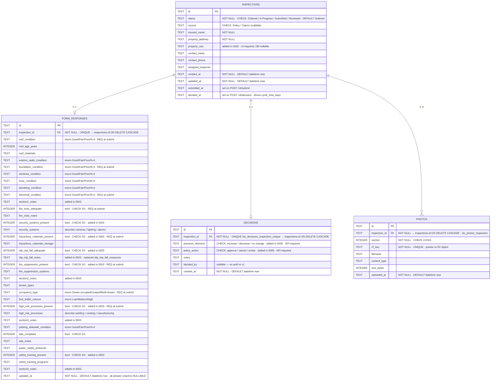

# ERD — D1 schema

> **Last regenerated:** 2026-05-26
> **Generated from:** `migrations/0001_init.sql` → `migrations/0005_finalize_decisions.sql` (full migration history applied).
> Regenerate at the end of every week — if it no longer matches the migrations, something drifted.

## How it works

`inspections` is the spine. Every other table joins to it by `inspection_id` and cascades on delete, so removing an inspection wipes its form, photos, and decision in one statement. `form_responses` and `decisions` are each one-row-per-inspection — enforced by `UNIQUE(inspection_id)` (an inline constraint on `form_responses`, an index named `idx_decisions_inspection_unique` on `decisions`) — which is what makes the `INSERT … ON CONFLICT(inspection_id) DO UPDATE` pattern legal in both routes and safe to retry on flaky connectivity. `photos` is one-to-many partitioned by `section (1..4)`; image bytes live in R2 (`photos.r2_key` is the pointer), not in D1.

## Field-spec notes

- **Every answer column in `form_responses` is NULLABLE on purpose.** John saves a section at a time in poor connectivity (PRD §8 Risk 1); a partial save must never fail a CHECK or NOT NULL.
- **"Required" is an API/UI submit gate, not a DB constraint.** The eight columns annotated `REQ at submit` are checked in `POST /api/orders/:id/submit` (see `REQUIRED_TO_SUBMIT` in `src/routes/forms.ts`). A `false` (0) boolean counts as a real answer; only `NULL` is "missing".
- **Booleans are `INTEGER CHECK (col IN (0, 1))`** — SQLite has no native bool. The route layer coerces JS booleans on write.
- **Condition / occupancy / traffic enums are plain TEXT.** Only `occupancy_type` carries an enum CHECK in D1; the others are enforced in `src/routes/forms.ts` so a bad value returns a clean 400 instead of a raw D1 constraint error.

## Decisions that shaped this design

1. **Image bytes in R2, only the pointer in D1.** `photos` stores `r2_key` (unique) plus metadata; the bytes live in the `inspection-photos` R2 bucket. Splitting this way keeps D1 small and lets the SPA stream images via a Worker route (`GET /:id/photos/:photoId`) without exposing the bucket — necessary because R2 objects are private. The proxied-upload-vs-presigned decision is in `docs/architecture.md`.

2. **`UNIQUE(inspection_id)` on `form_responses` and `decisions`, not a separate row per save.** Both writes are upserts on that constraint. This makes retries idempotent after a connectivity blip (PRD §8 Risk 1) without per-route deduping logic, and matches the v1 product rule of one form / one decision per inspection.

3. **Migrations are append-only; committed files are never edited in place.** The header in `0001_init.sql` sets the rule, and 0002–0005 follow it (e.g. 0003 adds Section-2 booleans + per-section notes rather than rewriting 0001; 0005 drops the placeholder `decision` column from 0001 rather than amending the original CREATE). Lets the local + remote D1 stay in lockstep with one `wrangler d1 migrations apply` command per environment.

## Things deliberately NOT on this diagram

- **R2 objects.** Shown in `docs/architecture.md` as the storage half of `photos`.
- **Soft deletes / archive flags.** No row in v1 is ever logically deleted; ON DELETE CASCADE handles hard deletes if they ever happen.
- **Audit trail / change history.** No `who-changed-what-when` table. `updated_at` is the only mutation timestamp; v2 will need this once auth lands.
- **Versioning of form responses.** One form per inspection, overwritten on each save. No history of prior submissions.
- **Indexes other than the ones enforcing FK/UNIQUE constraints.** `idx_inspections_status`, `idx_photos_inspection`, and `idx_decisions_inspection_unique` are the only ones today.

If any of those land, redraw this in the same session.
